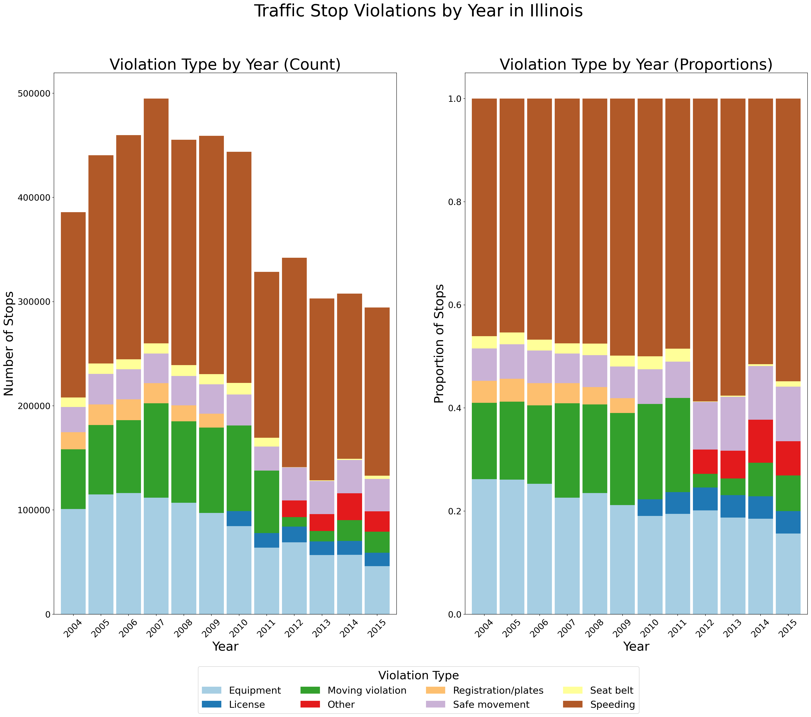

# Understanding Traffic Enforcement Dynamics
## Traffic Demand and Escalation Risk Patterns in IL

As traffic enforcement is one of the most common interactions between the public and law enforcement, understanding traffic stop patterns is essential for police departments looking to allocate their resources efficiently and improve performance, which this project does in order to provide a foundation for these organizations to make data-driven decisions.

### Tech Stack Used
- Python
- pandas, numpy
- matplotlib, seaborn

### Objectives:
- Explore how time and location shape traffic demand
- Explore combinations of stop characteristics that influence escalation risk of the stop
- Provide recommendations that can be used for officer staffing and deployment

### Dataset
Source: https://www.kaggle.com/datasets/stanford-open-policing/stanford-open-policing-project-illinois?resource=download

This dataset gathered by the Stanford Open Policing Project contains over 4M traffic stops ranging from 2004 to 2015, including 26 key features.

### Data Cleaning and Preparation
After checking for duplicates and converting columns into the proper data type, columns with too many missing values were removed, missing values that indicated a negative condition were imputed with their respective negative category, and specific columns were imputed using the mean of observations with similar characteristics. Afterward, redundant columns were removed and feature engineering was performed to extract useful features such as hour, day of the week, month, and year of the stop in order to facilitate analysis. 

### EDA
Before answering the questions posed, visuals were used to get a better understanding of the overall dataset. Visuals showing number of stops per year, month, and hour revealed that traffic stop trends were not uniform but rather showed clear temporal patterns. EDA exploring gender and violation type also revealed that male drivers accounted for more traffic stops than female drivers in this dataset and also exhibited a broader range of violation types. Violation by age plots were also explored which revealed that young adult drivers dominated traffic stops in this dataset.

One of the most informative visuals was traffic stops per year which revealed a notable data shift between 2011 and 2012. Specifically, the number of traffic stops decreased after 2010, and trends in violation types changed after 2011.

This data shift was taken into account when answering the questions posed.

### Methodology
Question 1: How do time and location shape traffic demand, and how can these patterns be used for officer staffing and deployment?

To answer this question, traffic demand was operationalized as the combination of traffic stop volume and intensity, which was measured by the number of traffic stops and their durations. These variables were explored in relation to time (year, month, and hour) and location (police district).

Question 2: How do combinations of stop characteristics influence traffic stop escalation risk?

To answer this question, stop characteristics were operationalized to district, driver_gender, driver_age, driver_race, violation, hour_of_day, month, and day_of_week and escalation risk was operationalized to non-routine stop characteristivs such as a search or discovery of contraband. Interactions of stop characteristics were explored in order to answer the question.

### Results and Insights
Question 1: Traffic demand occurs in predictable patterns rather than uniformly. When looking at stop volume vs. stop duration concurrently, an inverse relationship is present between these two variables which suggests that traffic demand cannot be fully captured by either variable alone. In addition, traffic enforcement is highly concentrated across certain police districts. These temporal and spatial patterns have direct implications for officer staffing and deployment as periods and locations with consistently high traffic demand may benefit from increased police presence. 

Question 2: Escalation risk is shaped by a small set of core factors such as violation type, time of day, age, and race. Interactions between these variables have shown to amplify the escalation risk.

### Limitations/Future Work
While this analysis provides an overview of how traffic enforcement activity varies and identifies recurring patterns that can be useful for operational planning, it does not establish a causal relationship or prescribe strategies for improving efficiency. This analysis is contrained by publicly unavailable key variables such as officer staffing levels, jurisdiction boundaries and size, traffic volume, enforcement policies and priorities, driver impairment or warrants, and officer safety concerns. Because of this, these observed patterns likely reflect a combination of underlying conditions that this analysis was unable to explore. For this reason, the findings of this analysis should be viewed as a foundation for further investigation rather than an assessment of optimal staffing, enforcement effectiveness, or police bias.

### Author
Youana Habib

youanahabib117@gmail.com
